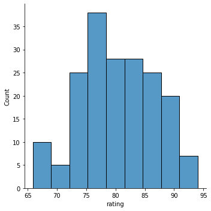
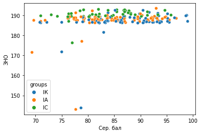
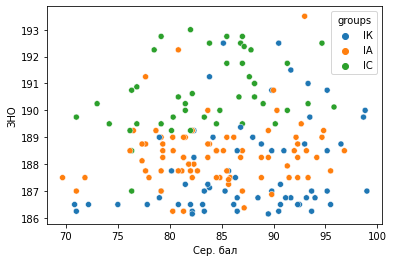
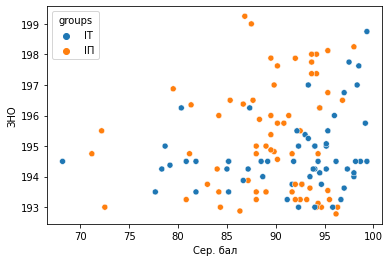

## Цель работы: проверить, есть ли зависимость между балом ЗНО студентов и их рейтингом в университете

Для работы использованы данные рейтинга студентов на бюджете 1-го курса КПИ факультета ФИВТ, взятые отсюда: [ссылка](https://dnvr.kpi.ua/wp-content/uploads/2021/02/2020-2021-1-%D0%A0%D0%B5%D0%B9%D1%82%D0%B8%D0%BD%D0%B3-%D0%A4%D0%86%D0%9E%D0%A2.pdf)

Баллы ЗНО этих студентов получены с сайта https://abit-poisk.org.ua/


```python
import pandas as pd
import numpy as np
import matplotlib.pyplot as plt
import seaborn as sns
```

Импортируем данные о рейтинге в университете студентов 126-й специальности


```python
rating_126 = pd.read_excel("rating_126.xlsx")
```


```python
rating_126.head()
```


<div>
<style scoped>
    .dataframe tbody tr th:only-of-type {
        vertical-align: middle;
    }

    .dataframe tbody tr th {
        vertical-align: top;
    }

    .dataframe thead th {
        text-align: right;
    }
</style>
<table border="1" class="dataframe">
  <thead>
    <tr style="text-align: right;">
      <th></th>
      <th>ПІБ</th>
      <th>Група</th>
      <th>Код спец.</th>
      <th>Сер. бал</th>
      <th>Дод. бал</th>
      <th>Рейтинг *</th>
    </tr>
  </thead>
  <tbody>
    <tr>
      <th>0</th>
      <td>Лінчук Анастасія  Вадимівна</td>
      <td>ІК-02</td>
      <td>126</td>
      <td>99.00</td>
      <td>NaN</td>
      <td>94.05</td>
    </tr>
    <tr>
      <th>1</th>
      <td>Крамар Анна  Петрівна</td>
      <td>ІК-02</td>
      <td>126</td>
      <td>98.83</td>
      <td>NaN</td>
      <td>93.89</td>
    </tr>
    <tr>
      <th>2</th>
      <td>Гацан Сергій  Юрійович</td>
      <td>ІК-01</td>
      <td>126</td>
      <td>98.67</td>
      <td>NaN</td>
      <td>93.73</td>
    </tr>
    <tr>
      <th>3</th>
      <td>Омельченко Анна  Юріївна</td>
      <td>ІК-01</td>
      <td>126</td>
      <td>95.50</td>
      <td>60.0</td>
      <td>93.73</td>
    </tr>
    <tr>
      <th>4</th>
      <td>Андреєв Андрій  Олександрович</td>
      <td>ІА-02</td>
      <td>126</td>
      <td>96.83</td>
      <td>NaN</td>
      <td>91.99</td>
    </tr>
  </tbody>
</table>
</div>


```python
rating_126.rename(columns={"Рейтинг *":"rating"}, inplace=True)
```

Распределение баллов по специальности


```python
sns.displot(rating_126.rating)
```


    <seaborn.axisgrid.FacetGrid at 0x24a1a80d490>


    

    


Средние баллы по группам


```python
rating_126.groupby(by="Група").rating.agg([np.mean, np.std]).sort_values(by="mean", ascending=False)
```


<div>
<style scoped>
    .dataframe tbody tr th:only-of-type {
        vertical-align: middle;
    }

    .dataframe tbody tr th {
        vertical-align: top;
    }

    .dataframe thead th {
        text-align: right;
    }
</style>
<table border="1" class="dataframe">
  <thead>
    <tr style="text-align: right;">
      <th></th>
      <th>mean</th>
      <th>std</th>
    </tr>
    <tr>
      <th>Група</th>
      <th></th>
      <th></th>
    </tr>
  </thead>
  <tbody>
    <tr>
      <th>ІК-01</th>
      <td>84.381905</td>
      <td>6.629942</td>
    </tr>
    <tr>
      <th>ІС-02</th>
      <td>81.922000</td>
      <td>5.810545</td>
    </tr>
    <tr>
      <th>ІА-02</th>
      <td>81.607222</td>
      <td>7.843569</td>
    </tr>
    <tr>
      <th>ІК-02</th>
      <td>81.201667</td>
      <td>6.078857</td>
    </tr>
    <tr>
      <th>ІА-04</th>
      <td>80.250526</td>
      <td>6.361489</td>
    </tr>
    <tr>
      <th>ІК-03</th>
      <td>80.179500</td>
      <td>7.087126</td>
    </tr>
    <tr>
      <th>ІА-01</th>
      <td>79.775714</td>
      <td>5.921114</td>
    </tr>
    <tr>
      <th>ІС-01</th>
      <td>79.760000</td>
      <td>6.348126</td>
    </tr>
    <tr>
      <th>ІА-03</th>
      <td>77.539524</td>
      <td>4.083766</td>
    </tr>
    <tr>
      <th>ІС-03</th>
      <td>77.500000</td>
      <td>4.133718</td>
    </tr>
  </tbody>
</table>
</div>


Импорт и обработка спрарсенных данных с баллами ЗНО 126-й специальности


```python
zno_126 = pd.read_csv('zno_126.csv', header=None)

zno_126['name'] = zno_126[0].apply(lambda x: x.strip())

zno_126.drop(0, axis=1, inplace=True)

zno_126.columns = ['score', 'name']

zno_126['surname'] = zno_126.name.apply(lambda x: x.split(" ")[0])
```


```python
zno_126
```


<div>
<style scoped>
    .dataframe tbody tr th:only-of-type {
        vertical-align: middle;
    }

    .dataframe tbody tr th {
        vertical-align: top;
    }

    .dataframe thead th {
        text-align: right;
    }
</style>
<table border="1" class="dataframe">
  <thead>
    <tr style="text-align: right;">
      <th></th>
      <th>score</th>
      <th>name</th>
      <th>surname</th>
    </tr>
  </thead>
  <tbody>
    <tr>
      <th>0</th>
      <td>188.75</td>
      <td>174-6891123 К. А.</td>
      <td>174-6891123</td>
    </tr>
    <tr>
      <th>1</th>
      <td>183.25</td>
      <td>Міхненко А. О.</td>
      <td>Міхненко</td>
    </tr>
    <tr>
      <th>2</th>
      <td>181.50</td>
      <td>Скрипник К. О.</td>
      <td>Скрипник</td>
    </tr>
    <tr>
      <th>3</th>
      <td>177.00</td>
      <td>Кучеренко К. А.</td>
      <td>Кучеренко</td>
    </tr>
    <tr>
      <th>4</th>
      <td>176.25</td>
      <td>Семенюк Д. В.</td>
      <td>Семенюк</td>
    </tr>
    <tr>
      <th>...</th>
      <td>...</td>
      <td>...</td>
      <td>...</td>
    </tr>
    <tr>
      <th>225</th>
      <td>186.25</td>
      <td>Тарасов В. О.</td>
      <td>Тарасов</td>
    </tr>
    <tr>
      <th>226</th>
      <td>186.25</td>
      <td>Епштейн А. К.</td>
      <td>Епштейн</td>
    </tr>
    <tr>
      <th>227</th>
      <td>186.15</td>
      <td>Булботка Н. В.</td>
      <td>Булботка</td>
    </tr>
    <tr>
      <th>228</th>
      <td>186.15</td>
      <td>Кречківська Т. В.</td>
      <td>Кречківська</td>
    </tr>
    <tr>
      <th>229</th>
      <td>186.00</td>
      <td>Полковський І. О.</td>
      <td>Полковський</td>
    </tr>
  </tbody>
</table>
<p>230 rows × 3 columns</p>
</div>


Соединим две таблицы в одну по фамилии


```python
rating_126['surname'] = rating_126['ПІБ'].apply(lambda x: x.split(" ")[0])

merged = rating_126.merge(zno_126, on='surname')[['ПІБ', 'Група', 'Сер. бал', 'score']]

merged['groups'] = merged['Група'].apply(lambda x: x.split('-')[0])
```


```python
sns.scatterplot(x='Сер. бал', y='score', data=merged, hue='groups')
plt.ylabel("ЗНО")
```


    Text(0, 0.5, 'ЗНО')


    

    


Как видим, на графики есть выборсы - студенты, которых перевели с контракта на бюджет из-за наличия свободных мест. Эти выборсы обрежем


```python
merged_cut = merged[merged['score'] > 183]
```


```python
sns.scatterplot(x='Сер. бал', y='score', data=merged_cut, hue='groups')
plt.ylabel("ЗНО")
```


    Text(0, 0.5, 'ЗНО')


    

    


Как видим, все точки распределены равномерно, то есть нет никакой зависимости между баллов ЗНО и баллом на сессии в университете на этой специальности.

Проделаем те же действия для 121-й специальности этого факультета


```python
rating_121 = pd.read_excel('rating_121.xlsx')
```


```python
rating_121
```


<div>
<style scoped>
    .dataframe tbody tr th:only-of-type {
        vertical-align: middle;
    }

    .dataframe tbody tr th {
        vertical-align: top;
    }

    .dataframe thead th {
        text-align: right;
    }
</style>
<table border="1" class="dataframe">
  <thead>
    <tr style="text-align: right;">
      <th></th>
      <th>ПІБ</th>
      <th>Група</th>
      <th>Код спец.</th>
      <th>Сер. бал</th>
      <th>Дод. бал</th>
      <th>Рейтинг *</th>
    </tr>
  </thead>
  <tbody>
    <tr>
      <th>0</th>
      <td>Гордуз Олександр  Сергійович</td>
      <td>ІТ-03</td>
      <td>121</td>
      <td>99.33</td>
      <td>NaN</td>
      <td>94.37</td>
    </tr>
    <tr>
      <th>1</th>
      <td>Макаров Ілля  Сергійович</td>
      <td>ІТ-02</td>
      <td>121</td>
      <td>99.33</td>
      <td>NaN</td>
      <td>94.37</td>
    </tr>
    <tr>
      <th>2</th>
      <td>Куксюк Владислав  Ігорович</td>
      <td>ІТ-03</td>
      <td>121</td>
      <td>99.17</td>
      <td>NaN</td>
      <td>94.21</td>
    </tr>
    <tr>
      <th>3</th>
      <td>Ящук Денис  Андрійович</td>
      <td>ІТ-04</td>
      <td>121</td>
      <td>98.67</td>
      <td>NaN</td>
      <td>93.73</td>
    </tr>
    <tr>
      <th>4</th>
      <td>Гавриленко Ян  Сергійович</td>
      <td>ІТ-04</td>
      <td>121</td>
      <td>98.50</td>
      <td>NaN</td>
      <td>93.58</td>
    </tr>
    <tr>
      <th>...</th>
      <td>...</td>
      <td>...</td>
      <td>...</td>
      <td>...</td>
      <td>...</td>
      <td>...</td>
    </tr>
    <tr>
      <th>129</th>
      <td>Чуєнко Дмитро  Віталійович</td>
      <td>ІП-04</td>
      <td>121</td>
      <td>72.50</td>
      <td>NaN</td>
      <td>68.88</td>
    </tr>
    <tr>
      <th>130</th>
      <td>Зеленський Олександр  Васильович</td>
      <td>ІП-01</td>
      <td>121</td>
      <td>72.17</td>
      <td>NaN</td>
      <td>68.56</td>
    </tr>
    <tr>
      <th>131</th>
      <td>Кльова Микола  Михайлович</td>
      <td>ІТ-04</td>
      <td>121</td>
      <td>72.17</td>
      <td>NaN</td>
      <td>68.56</td>
    </tr>
    <tr>
      <th>132</th>
      <td>Глущенко Олександр  Володимирович</td>
      <td>ІП-02</td>
      <td>121</td>
      <td>71.17</td>
      <td>NaN</td>
      <td>67.61</td>
    </tr>
    <tr>
      <th>133</th>
      <td>Перетятько Ілля  Олегович</td>
      <td>ІТ-04</td>
      <td>121</td>
      <td>68.17</td>
      <td>NaN</td>
      <td>64.76</td>
    </tr>
  </tbody>
</table>
<p>134 rows × 6 columns</p>
</div>


```python
rating_121['surname'] = rating_121['ПІБ'].apply(lambda x: x.split(" ")[0])
```


```python
zno_121 = pd.read_csv('zno_121.csv', header=None)
zno_121['name'] = zno_121[0].apply(lambda x: x.strip())
zno_121.drop(0, axis=1, inplace=True)
zno_121.columns = ['score', 'name']
zno_121['surname'] = zno_121.name.apply(lambda x: x.split(" ")[0])
```


```python
merged_121 = rating_121.merge(zno_121, on='surname')[['ПІБ', 'Група', 'Сер. бал', 'score']]
merged_121['groups'] = merged_121['Група'].apply(lambda x: x.split('-')[0])
merged_121_cut = merged_121[merged_121['score'] > 188]
```


```python
sns.scatterplot(x='Сер. бал', y='score', data=merged_121_cut, hue='groups')
plt.ylabel("ЗНО")
```


    Text(0, 0.5, 'ЗНО')


    

    


Со 121-й специальностью систуация аналогична.
